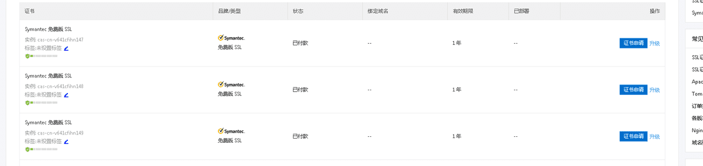
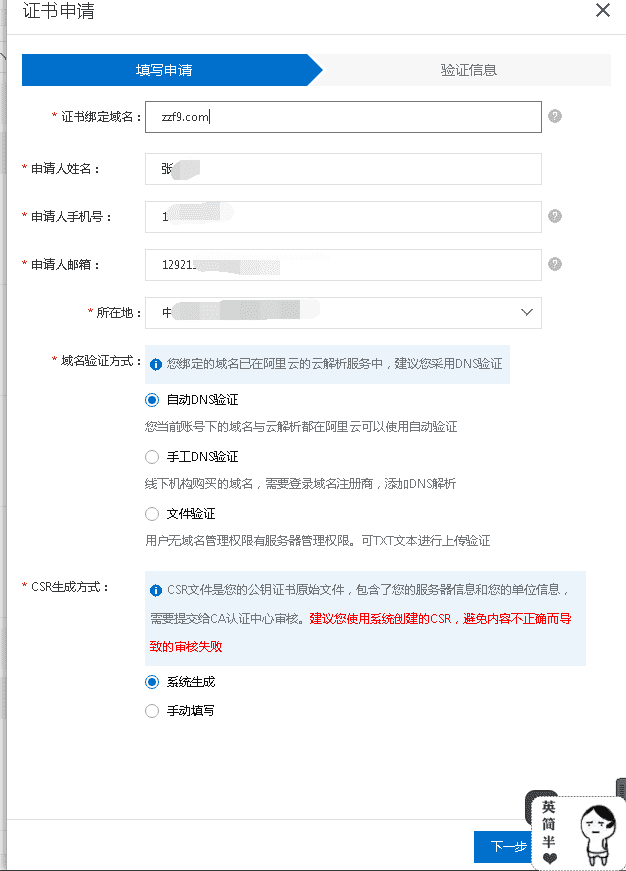
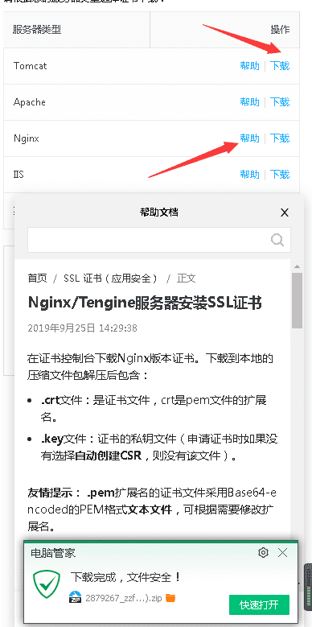

### 前言

你需要有已经安装的nginx 并且有相应的基础 如果没有请移步 我的文章安装 nginx+https笔记

本文是阿里云操作，如果不是阿里云的，请直接移步下面的配置 快捷移步

<a href="https://help.aliyun.com/knowledge_detail/95491.html" target="_blank" rel="noopener">官方nginx配置地址</a>

<p style="font-size:20px;border-bottom:1px solid #ddd;padding-bottom:5px;">进入控制台SSL</p>

登录进去申请证书 点击购买证书 =》选择免费形Dv SSL 因为他是0元


点击购买 选择最后一个费形Dv


立即购买 根据指定操作购买 没有难度 本文省略 直到下一图



选择证书申请 然后填写指定资料 不懂的配置跟我一样就好了 不用改



点击解析 如果是阿里云的直接会自动解析 如果不是就手动解析域名就好了 审核成功会出现如下图


然后就是等审核了


审核成功以后自主选择下载



<p style="font-size:20px;border-bottom:1px solid #ddd;padding-bottom:5px;">在证书控制台下载Nginx版本证书。</p>

<blockquote>
<p>在证书控制台下载Nginx版本证书。下载到本地的压缩文件包解压后包含：<br>
1..crt文件：是证书文件，crt是pem文件的扩展名。 <br>
2.key文件：证书的私钥文件（申请证书时如果没有选择自动创建CSR，则没有该文件）。</p>
</blockquote>

友情提示： .pem扩展名的证书文件采用Base64-encoded的PEM格式文本文件，可根据需要修改扩展名。

以Nginx标准配置为例，假如证书文件名是a.pem，私钥文件是a.key。

###### 在Nginx的安装目录下创建cert目录，并且将下载的全部文件拷贝到cert目录中。如果申请证书时是自己创建的CSR文件，请将对应的私钥文件放到cert目录下并且命名为a.key；

打开 Nginx 安装目录下 conf 目录中的 nginx.conf 文件，找到：

```javascript
    
    # HTTPS server
    # #server {
    # listen 443;
    # server_name localhost;
    # ssl on;
    # ssl_certificate cert.pem;
    # ssl_certificate_key cert.key;
    # ssl_session_timeout 5m;
    # ssl_protocols SSLv2 SSLv3 TLSv1;
    # ssl_ciphers ALL:!ADH:!EXPORT56:RC4+RSA:+HIGH:+MEDIUM:+LOW:+SSLv2:+EXP;
    # ssl_prefer_server_ciphers on;
    # location / {
    #
    #
    #}
#}
```

修改为成如下图

```javascript
       server {
        listen 443;
        server_name localhost;
        ssl on;
        root html;
        index index.html index.htm;
        ssl_certificate   cert/a.pem;  //改成你的目录
        ssl_certificate_key  cert/a.key; //一样改成你的目录 其他可以暂时不用挨
        ssl_session_timeout 5m;
        ssl_ciphers ECDHE-RSA-AES128-GCM-SHA256:ECDHE:ECDH:AES:HIGH:!NULL:!aNULL:!MD5:!ADH:!RC4;
        ssl_protocols TLSv1 TLSv1.1 TLSv1.2;
        ssl_prefer_server_ciphers on;
        location / {
            root html;
            index index.html index.htm;
        }
    }
```
保存退出。

重启 Nginx。

```javascript
 nginx -s reload

```

##### 总结：其实还是蛮简单的哈,如果重启报错找不到ssl 重装nginx，建议不要去用百度的找到源文件然后重新解压，本人这里当时卡了一天，重装了下才好了，总体原因是不报错不提醒，不运行！重装就OK

本人全部配置源代码配置为

```javascript
   # For more information on configuration, see:
       #   * Official English Documentation: http://nginx.org/en/docs/
       #   * Official Russian Documentation: http://nginx.org/ru/docs/

       user nginx;
       worker_processes auto;
       error_log /var/log/nginx/error.log;
       pid /run/nginx.pid;

       # Load dynamic modules. See /usr/share/nginx/README.dynamic.
       include /usr/share/nginx/modules/*.conf;

       events {
           worker_connections 1024;
       }

       http {
           log_format  main  '$remote_addr - $remote_user [$time_local] "$request" '
                           '$status $body_bytes_sent "$http_referer" '
                           '"$http_user_agent" "$http_x_forwarded_for"';

           access_log  /var/log/nginx/access.log  main;

           sendfile            on;
           tcp_nopush          on;
           tcp_nodelay         on;
           keepalive_timeout   65;
           types_hash_max_size 2048;

           include             /etc/nginx/mime.types;
           default_type        application/octet-stream;

           # Load modular configuration files from the /etc/nginx/conf.d directory.
           # See http://nginx.org/en/docs/ngx_core_module.html#include
           # for more information.
           # include /etc/nginx/conf.d/*.conf;
       server {
               listen       80;
               server_name  abc.zzf9.com;
               location / {
                   root   html;
                   proxy_pass http://abc.zzf9.com;
               }
           }

           upstream abc.zzf9.com {
               server abc.zzf9.com:8888 weight=1;
           }
           server {
               listen 80;
               server_name zzf9.com;
               rewrite ^(.*)$ https://$host$1 permanent;
           }
           server {
               listen 443;
               server_name zzf9.com;
               ssl on;
               ssl_certificate  cert/2879267_zzf9.com.pem;
               ssl_certificate_key cert/2879267_zzf9.com.key;
               ssl_session_timeout 5m;
               ssl_ciphers ECDHE-RSA-AES128-GCM-SHA256:ECDHE:ECDH:AES:HIGH:!NULL:!aNULL:!MD5:!ADH:!RC4;
               ssl_protocols TLSv1 TLSv1.1 TLSv1.2;
               ssl_prefer_server_ciphers on;
               location / {
                   root   /usr/www;
                   index  index.html index.htm;
               }
           }

       }
```