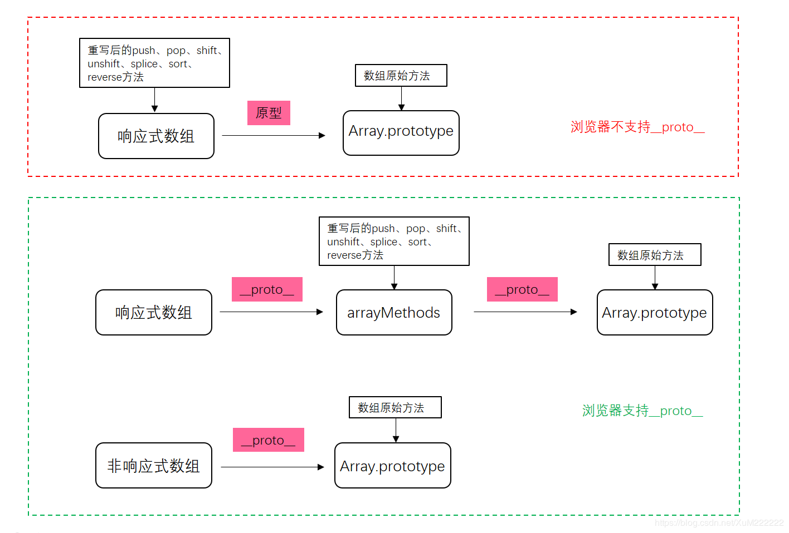
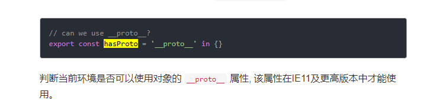

我们知道通过Object.defineProperty()劫持数组为其设置getter和setter后，调用的数组的push、splice、pop等方法改变数组元素时并不会触发数组的setter，这就会造成使用上述方法改变数组后，页面上并不能及时体现这些变化，也就是数组数据变化不是响应式的（对上述不了解的可以参考这篇文章）。但实际用vue开发时，对于响应式数组，使用push、splice、pop等方法改变数组时，页面会及时体现这种变化，那么vue中是如何实现的呢？

通过vue源码可以看出，vue重写了数组的push、splice、pop等方法 (通过vue源码可以看出，vue重写了数组的push、splice、pop等方法)[https://github.com/vuejs/vue/blob/dev/src/core/observer/array.js]

```javascript{3}
// src/core/observer/array.js

// 获取数组的原型Array.prototype，上面有我们常用的数组方法
const arrayProto = Array.prototype
// 创建一个空对象arrayMethods，并将arrayMethods的原型指向Array.prototype
export const arrayMethods = Object.create(arrayProto)

// 列出需要重写的数组方法名
const methodsToPatch = [
  'push',
  'pop',
  'shift',
  'unshift',
  'splice',
  'sort',
  'reverse'
]
// 遍历上述数组方法名，依次将上述重写后的数组方法添加到arrayMethods对象上
methodsToPatch.forEach(function (method) {
  // 保存一份当前的方法名对应的数组原始方法
  const original = arrayProto[method]
  // 将重写后的方法定义到arrayMethods对象上，function mutator() {}就是重写后的方法
  def(arrayMethods, method, function mutator (...args) {
    // 调用数组原始方法，并传入参数args，并将执行结果赋给result
    const result = original.apply(this, args)
    // 当数组调用重写后的方法时，this指向该数组，当该数组为响应式时，就可以获取到其__ob__属性
    const ob = this.__ob__
    let inserted
    switch (method) {
      case 'push':
      case 'unshift':
        inserted = args
        break
      case 'splice':
        inserted = args.slice(2)
        break
    }
    if (inserted) ob.observeArray(inserted)
    // 将当前数组的变更通知给其订阅者
    ob.dep.notify()
    // 最后返回执行结果result
    return result
  })
})
```
从上面可以看出array.js中重写了数组的push、pop、shift、unshift、splice、sort、reverse七种方法，重写方法在实现时除了将数组方法名对应的原始方法调用一遍并将执行结果返回外，还通过执行ob.dep.notify()将当前数组的变更通知给其订阅者，这样当使用重写后方法改变数组后，数组订阅者会将这边变化更新到页面中。

重写完数组的上述7种方法外，我们还需要将这些重写的方法应用到数组上，因此在Observer构造函数中，可以看到在监听数据时会判断数据类型是否为数组。当为数组时，如果浏览器支持__proto__，则直接将当前数据的原型__proto__指向重写后的数组方法对象arrayMethods，如果浏览器不支持__proto__，则直接将arrayMethods上重写的方法直接定义到当前数据对象上；当数据类型为非数组时，继续递归执行数据的监听。

```javascript
// src/core/observer/index.js
export class Observer {
  ...
  constructor (value: any) {
    this.value = value
    this.dep = new Dep()
    this.vmCount = 0
    def(value, '__ob__', this)
    if (Array.isArray(value)) {
      if (hasProto) {
        protoAugment(value, arrayMethods)
      } else {
        copyAugment(value, arrayMethods, arrayKeys)
      }
      this.observeArray(value)
    } else {
      this.walk(value)
    }
  }
  ...
}
function protoAugment (target, src: Object) {
  /* eslint-disable no-proto */
  target.__proto__ = src
  /* eslint-enable no-proto */
}
function copyAugment (target: Object, src: Object, keys: Array<string>) {
  for (let i = 0, l = keys.length; i < l; i++) {
    const key = keys[i]
    def(target, key, src[key])
  }
}
```
经过上述处理后，对于数组，当我们调用其方法处理数组时会按照如下原型链来获取数组方法：



对于响应式数组，当浏览器支持__proto__属性时，使用push等方法时先从其原型arrayMethods上寻找push方法，也就是重写后的方法，处理之后数组的变化会通知到其订阅者，更新页面，当在arrayMethods上查询不到时会向上在Array.prototype上查询；当浏览器不支持__proto__属性时，使用push等方法时会先从数组自身上查询，如果查询不到会向上再Array.prototype上查询。

对于非响应式数组，当使用push等方法时会直接从Array.prototype上查询。

值得一提的是源码中通过判断浏览器是否支持__proto__来分别使用protoAugment和copyAugment 方法将重写后的数组方法应用到数组中，这是因为对于IE10及以下的IE浏览器是不支持__proto__属性的：



结论：

在将数组处理成响应式数据后，如果使用数组原始方法改变数组时，数组值会发生变化，但是并不会触发数组的setter来通知所有依赖该数组的地方进行更新，为此，vue通过重写数组的某些方法来监听数组变化，重写后的方法中会手动触发通知该数组的所有依赖进行更新。